МИНИСТЕРСТВО НАУКИ  И ВЫСШЕГО ОБРАЗОВАНИЯ РОССИЙСКОЙ ФЕДЕРАЦИИ  
Федеральное государственное автономное образовательное учреждение высшего образования"КРЫМСКИЙ ФЕДЕРАЛЬНЫЙ УНИВЕРСИТЕТ им. В. И. ВЕРНАДСКОГО"  
ФИЗИКО-ТЕХНИЧЕСКИЙ ИНСТИТУТ  
Кафедра компьютерной инженерии и моделирования
<br/><br/>

### Отчёт по лабораторной работе № 7<br/> по дисциплине "Программирование"
<br/>
студента 1 курса
<br/>
группы ПИ-б-о-191(1)
<br/>
Пихтиенко Дарьи Владиславовны
<br/>
направления подготовки 09.03.04 "Программная инженерия"  
<br/><br/>


<table>

<tr><td>Научный руководитель<br/> старший преподаватель кафедры<br/> компьютерной инженерии и моделирования</td>

<td>(оценка)</td>

<td>Чабанов В.В.</td>

</tr>

</table>

<br/><br/>
Симферополь, 2019

Цель: изучить основные возможности создания и отладки программ в IDE Qt Creator.
<br/><br/>
Ход работы
<br/>**1.** Как создать консольное приложение С++ в IDE Qt Creator без использования компонентов Qt?    
 
  Создаем новый файл\проект,выбираем "Проект без Qt","приложение С++".
 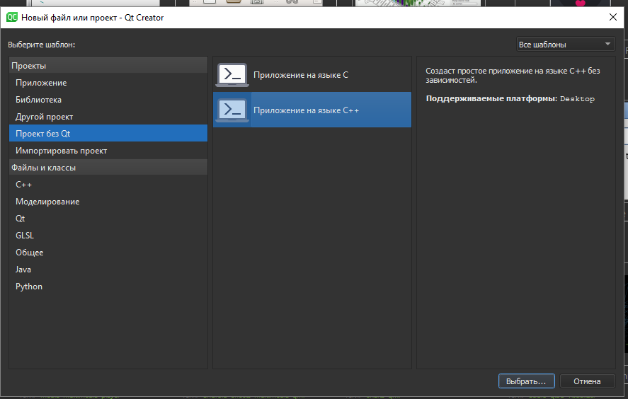<br/> ***рисунок №1 Создание проекта***
 <br/><br/>
 **2.** Как изменить цветовую схему (оформление) среды?<br/><br/>
 Для того, чтобы изменить оформление в Qt необходимо в строке меню нажать кнопку “Инструменты”, затем выбрать пункт “Параметры”.
 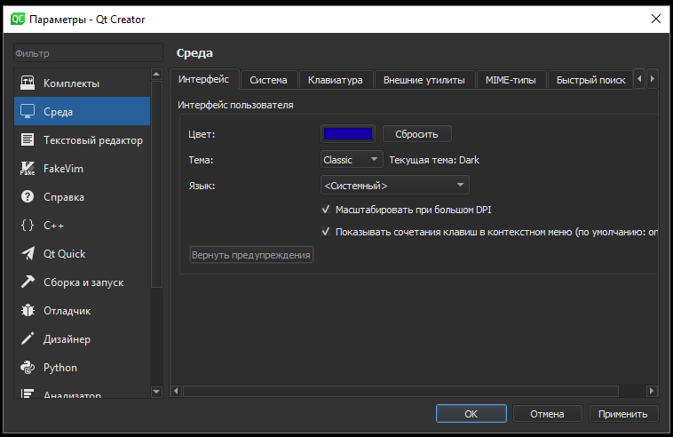</br>***рисунок №2 Изменение темы***<br/><br/>
 В открывшемся окне в левом столбце выбираем группу “Среда”,здесь мы можем менять тему.<br/><br/>
 **3.** Как закомментировать/раскомментировать блок кода средствами  Qt Creator;<br/><br/>
Для того что бы закоментировать часть кода в  Qt Creator необходимо ее выделить и нажать сочетание клавиш Ctrl+/.<br/>
 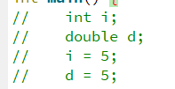</br>***рисунок №3 Закомментированный блок кода***<br/>
 Для раскоментирования выделенного текста нужно нажать то же сочетание клавиш Ctrl+/.<br/><br/>
 **4.** Как открыть в проводнике Windows папку с проектом средствами Qt Creator?<br/><br/>
 Для открытия папки с проектом находясь в Qt необходимо во вкладке "Начало" нажать "Проекты" и выбрать свой проект.
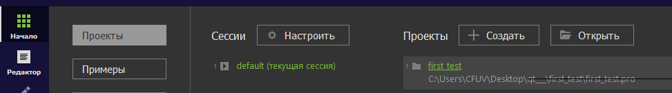</br>***рисунок №4 Открытие в проводнике Windows***<br/><br/>
 **5.** Какое расширение файла-проекта используется Qt Creator?<br/><br/>
 В Qt Creator для файлов-проектов используется расширение **.pro** .<br/><br/>
 **6.** Как запустить код без отладки;<br/><br/>
 Для запуска кодa без отладки нужно в разделе “Сборка” выбрать пункт “Запустить” или использовать комбинацию клавиш Ctrl+R.<br/>
 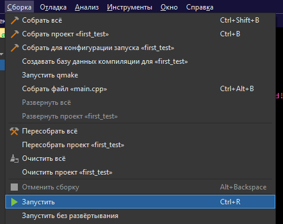</br>***рисунок №5 Запуск кода без отладки***<br/><br/>

 
 **7.** Как запустить код в режиме отладки;<br/><br/>
 Для запуска кодa в режиме отладки нужно в разделе “Отладка” выбрать пункт “Начать отладку” >>"Начать отладку запускающего проекта".<br/>
 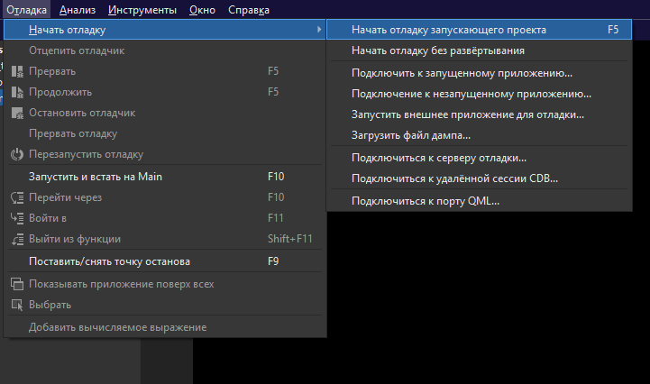</br>***рисунок №6 Запуск кода с отладкой***<br/>
 Также можно использовать клавишу F5.
<br/><br/>
**8.** Как установить/убрать точку останова (breakpoint);<br/><br/>
Чтобы установить/убрать точку останова в Qt, нужно щелкнуть в левом поле рядом с интересующей строкой кода.<br/><br/>
**9.** Создать программу;<br/><br/>
1)Создала программу с предоставленным кодом:<br/>
```C++
#include <iostream>
int main() {
    int i;
    double d;
    i = 5;
    d = 5;
    std::cout << i << d;
    return 0;
}
```
2)Переключилась в конфигурацию сборки «Отладка»;<br/>
3)Установила breakpoint на 5, 6 и 7 строках;<br/>
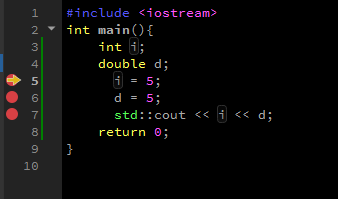</br>***рисунок №7 Точки останова***<br/>
4)Запустила приложение щелкнув по кнопке с изображением жука . <br/>
5)Используя эту же кнопку переходим к следующей точке останова;<br/>
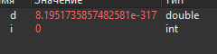</br>***рисунок №8 Отладка и результат программы***<br/>

 В строке 5, переменная i имела значение 0, а в строке 6 изменила его на 5.<br/><br/>
 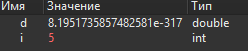</br>***рисунок №9 Отладка и результат программы***<br/>
 До 7 строки переменная d типа double имела "мусорное" значение, но в 7 строчке стала равная 5.<br/><br/>
 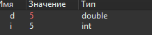</br>***рисунок №10 Отладка и результат программы***<br/>
 **10.** Закрываем проект и переходим на вкладку «Начало» => «Примеры»;<br/>
 **11.** Выбираем проект «Calculator Form Example»;<br/>
 **12.** Изучим описание проекта в открывшемся окне;<br/>
 **13.** Сейчас мы находимся на вкладке «Проекты». Выберем комплект сборки;<br/>
 **14.** Перейдем на вкладку «Редактор» и запустим сборку проекта;<br/>
 **15.** В инспекторе проекта выберем файл «main.cpp». В этом файле установим курсор на слово «show» в строке calculator.show(); и нажмем F1. Изучим справочную информацию.<br/>
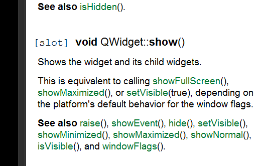</br>***рисунок №11 Справка по show***<br/>
 **16.** В инспекторе проекта выберем файл «Формы» => «calculatorform.ui» и дважды счёлкнем ЛКМ;<br/><br/>
 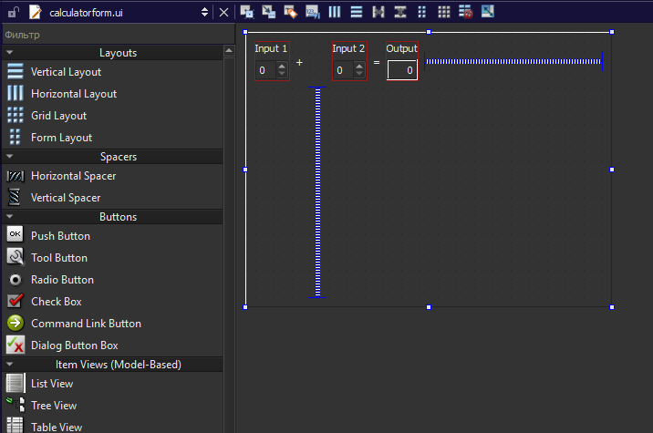</br>***рисунок №12 Дизайн форм калькулятора*** <br/>
 **17.** Заменим английский текст на русский. Пересоберем проект;<br/>
 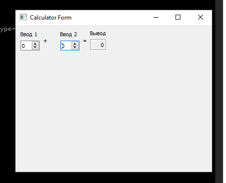</br>***рисунок №13 Редизайн форм калькулятора ***<br/>
<br/><br/>
 **Вывод:** Приобрела базовые навыки работы(отладки) с программой в Qt Creator.
 
